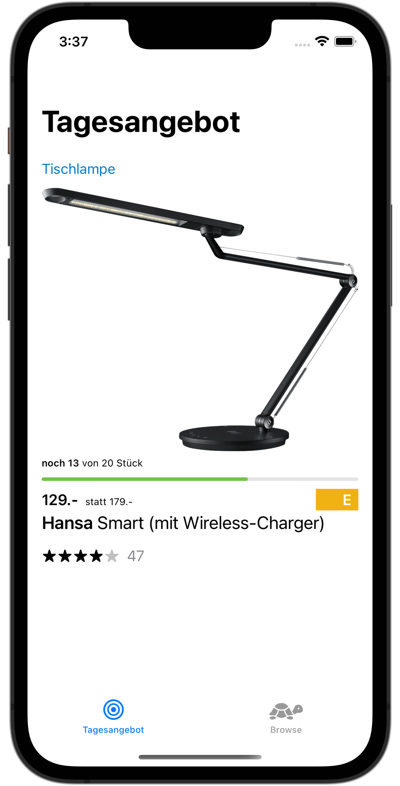
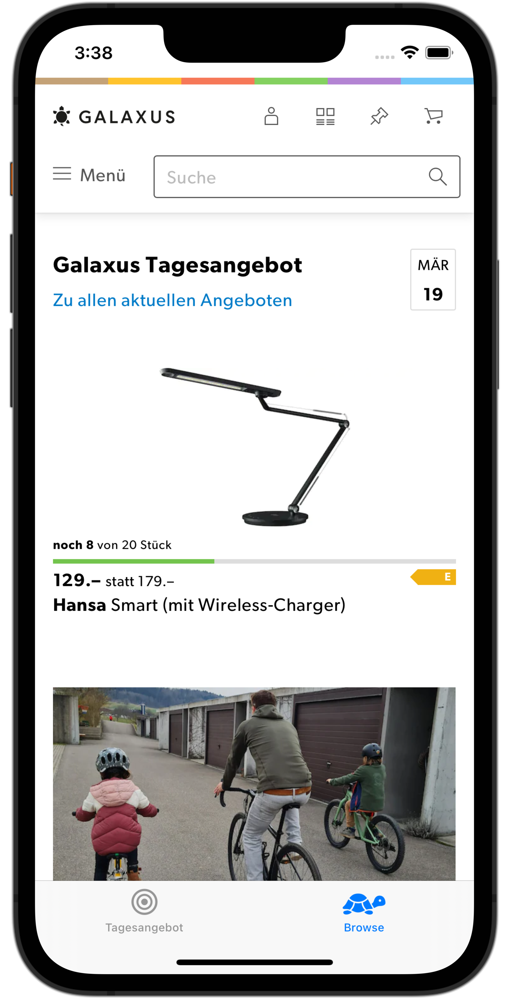

#  Galaxus Browser

A small three hour project (10:10 - 13:03 according to `git log`), to prove what I could do.

The current state is:

- tab view showing the "offer of the day" and a WebView for the web shop.
- "offer of the day" view has he same layout as in the web shop but is fully written in SwiftUI.
- tapping the view will open the web browser (Safari) with the product detail URL  
- the product data is parsed from a hardcoded JSON structure which is based `get-liveshopping-previewsv3` request data
- the webview uses swipe to navigate back and forth (this is why there are no toolbar buttons)

Possible improvements:

- Use custom "arrow shape" for the energy label (instead of the plain rectangle)
- fetching "offer of the day" from `liveshopping-preview` URL showing accurate/up-to-date information.
- tapping the products view could switch to the "browse" tab, to load the details of the product or (even better) 
  navigate to a webview showing only detail information for the product (possibly without all the web shop navigation).
- using the same custom fonts as in the web shop
- putting the product of the day in a Widget as it is in the official galaxus app

